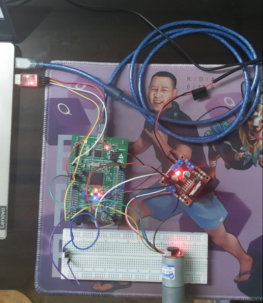
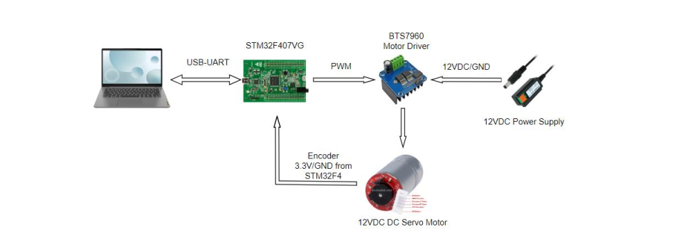
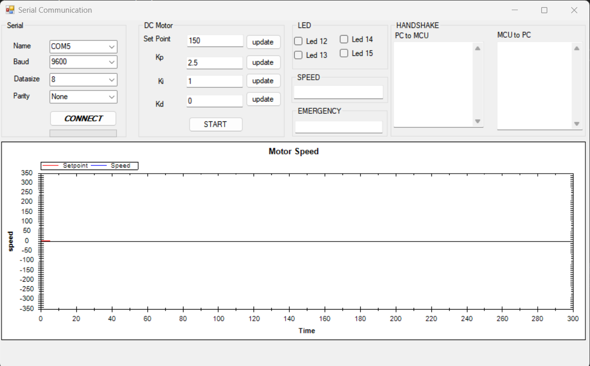
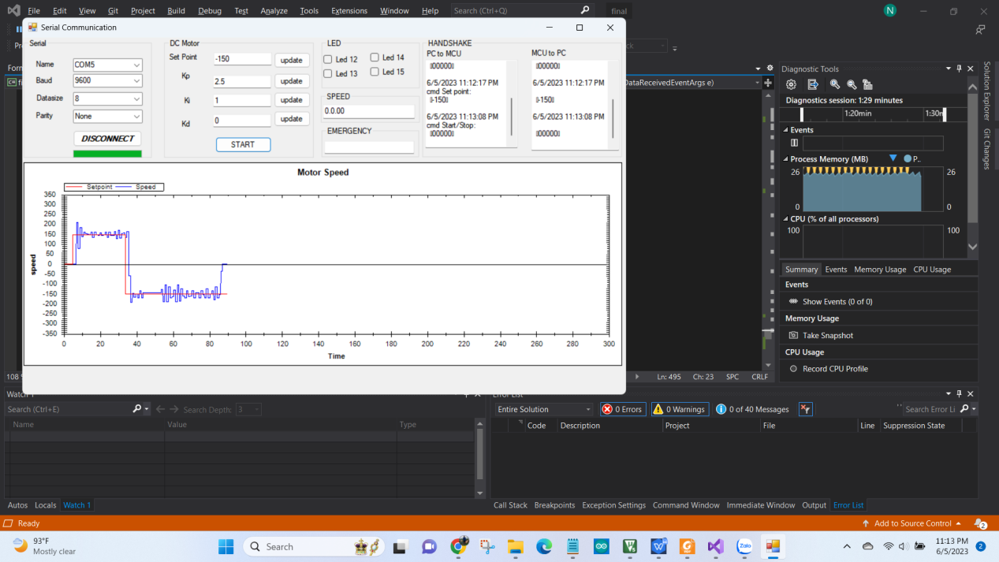
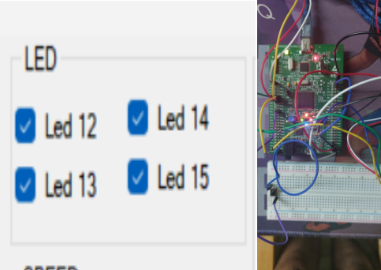
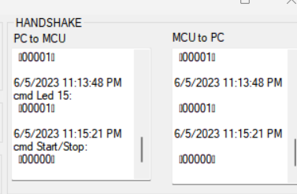

# CONTROL DC MOTOR BY STM32F4 WITH PID THEORY
I control speed of DC motor using STM32 microcontroller and L293 H-bridge.
Drawing response of signal processing by reading encoder in GUI, that is coded by C# in Visual Studio.

## IMAGES FOR PROJECT
 
Image realistic
 
Image connection diagrams
 
Image GUI C#

## Result
 
 Set point 150rpm and -150rpm
 
 4 LED
  
 Emergency button
 
 Hand Shake
